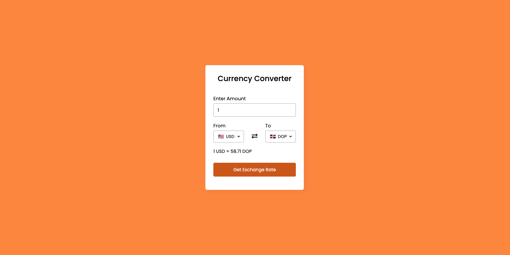

This project demonstrates a simple currency converter built with HTML, CSS, and JavaScript. It leverages the ExchangeRate API to provide real-time currency conversion rates.

## Supported Currencies

The currency converter supports the following currencies:
- AED (United Arab Emirates Dirham)
- ARS (Argentine Peso)
- AUD (Australian Dollar)
- BGN (Bulgarian Lev)
- BRL (Brazilian Real)
- ... (and more)

## Prerequisites

Before you begin, ensure you have the following:
- Basic understanding of HTML, CSS, and JavaScript
- A code editor (such as Visual Studio Code or Sublime Text) to write and save your code

## Project Structure

1. **index.html**: The main HTML file containing the structure for the currency converter.
2. **style.css**: CSS file for styling the converter.
3. **script.js**: JavaScript file responsible for fetching exchange rates and performing conversions.
4. **country-list.js**: Javascript file responsible for all storing all the country codes.

## How to Use

1. Clone this repository to your local machine.
2. Open **index.html** in your web browser.
3. Enter the amount in the base currency (e.g., USD).
4. Select the target currency from the dropdown.
5. Click the "Get Exchange Rate" button to see the converted amount.

## API Integration

We use the [ExchangeRate API](https://www.exchangerate-api.com/) to fetch real-time exchange rates. You'll need to sign up for an API key and replace the placeholder in **script.js** with your actual key.

## Preview



Feel free to customize and enhance this project as needed. Happy coding! 🚀
```

Remember to replace the placeholder paths and add your own preview image. If you haven't already, sign up for the [ExchangeRate API](https://www.exchangerate-api.com/) to obtain your API key.

Feel free to modify this README to suit your project's specifics. Good luck with your currency converter! 🌟
